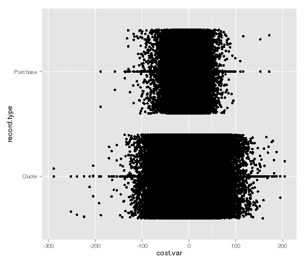
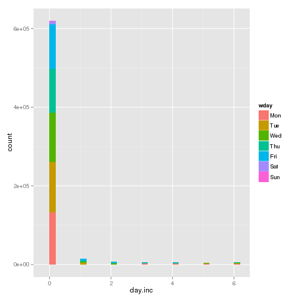

All State Purchase Competition
====

13/4/2014
---
Here we initially analyse the data to begin to understand it. 

The data was first eyeballed in csv format to understand its layout. The problem boils down to predict what options the customers eventually purchases based on their shopping history in order to speed up the sales process.

i.e. 
Predict what options a person settles for and for how much.

The training set contains complete history and the final purchased option
The test sets contains a truncated history. You are not told that the person purchases, i.e. the training set could include people that do not purchase but are just browsing?


Load the data
---


```r
## Use the data table package, The structure is much quicker than dataframes
## We can also perform grouped calcs very concisely
library(data.table)
data <- fread("./data/train.csv")
no.observations <- nrow(data)
```


```r
## Structure of the data Number of rows
nrow(data)
```

```
## [1] 665249
```

```r
## Number of columns
ncol(data)
```

```
## [1] 25
```

```r
## Other Summaries
summary(data)
```

```
##   customer_ID        shopping_pt     record_type         day      
##  Min.   :10000000   Min.   : 1.00   Min.   :0.000   Min.   :0.00  
##  1st Qu.:10038523   1st Qu.: 2.00   1st Qu.:0.000   1st Qu.:1.00  
##  Median :10076403   Median : 4.00   Median :0.000   Median :2.00  
##  Mean   :10076553   Mean   : 4.22   Mean   :0.146   Mean   :1.97  
##  3rd Qu.:10114696   3rd Qu.: 6.00   3rd Qu.:0.000   3rd Qu.:3.00  
##  Max.   :10152724   Max.   :13.00   Max.   :1.000   Max.   :6.00  
##                                                                   
##      time              state              location       group_size  
##  Length:665249      Length:665249      Min.   :10001   Min.   :1.00  
##  Class :character   Class :character   1st Qu.:10936   1st Qu.:1.00  
##  Mode  :character   Mode  :character   Median :12027   Median :1.00  
##                                        Mean   :12272   Mean   :1.24  
##                                        3rd Qu.:13426   3rd Qu.:1.00  
##                                        Max.   :16580   Max.   :4.00  
##                                                                      
##    homeowner        car_age       car_value          risk_factor    
##  Min.   :0.000   Min.   : 0.00   Length:665249      Min.   :1       
##  1st Qu.:0.000   1st Qu.: 3.00   Class :character   1st Qu.:2       
##  Median :1.000   Median : 7.00   Mode  :character   Median :3       
##  Mean   :0.536   Mean   : 8.14                      Mean   :3       
##  3rd Qu.:1.000   3rd Qu.:12.00                      3rd Qu.:4       
##  Max.   :1.000   Max.   :85.00                      Max.   :4       
##                                                     NA's   :240418  
##    age_oldest  age_youngest  married_couple   C_previous   
##  Min.   :18   Min.   :16.0   Min.   :0.00   Min.   :1      
##  1st Qu.:28   1st Qu.:26.0   1st Qu.:0.00   1st Qu.:1      
##  Median :44   Median :40.0   Median :0.00   Median :3      
##  Mean   :45   Mean   :42.6   Mean   :0.21   Mean   :2      
##  3rd Qu.:60   3rd Qu.:57.0   3rd Qu.:0.00   3rd Qu.:3      
##  Max.   :75   Max.   :75.0   Max.   :1.00   Max.   :4      
##                                             NA's   :18711  
##  duration_previous       A               B               C       
##  Min.   : 0        Min.   :0.000   Min.   :0.000   Min.   :1.00  
##  1st Qu.: 2        1st Qu.:1.000   1st Qu.:0.000   1st Qu.:1.00  
##  Median : 5        Median :1.000   Median :0.000   Median :2.00  
##  Mean   : 6        Mean   :0.927   Mean   :0.454   Mean   :2.27  
##  3rd Qu.: 9        3rd Qu.:1.000   3rd Qu.:1.000   3rd Qu.:3.00  
##  Max.   :15        Max.   :2.000   Max.   :1.000   Max.   :4.00  
##  NA's   :18711                                                   
##        D              E               F              G       
##  Min.   :1.00   Min.   :0.000   Min.   :0.00   Min.   :1.00  
##  1st Qu.:2.00   1st Qu.:0.000   1st Qu.:0.00   1st Qu.:2.00  
##  Median :3.00   Median :0.000   Median :1.00   Median :2.00  
##  Mean   :2.45   Mean   :0.445   Mean   :1.16   Mean   :2.27  
##  3rd Qu.:3.00   3rd Qu.:1.000   3rd Qu.:2.00   3rd Qu.:3.00  
##  Max.   :3.00   Max.   :1.000   Max.   :3.00   Max.   :4.00  
##                                                              
##       cost    
##  Min.   :260  
##  1st Qu.:605  
##  Median :635  
##  Mean   :636  
##  3rd Qu.:665  
##  Max.   :922  
## 
```

```r
str(data)
```

```
## Classes 'data.table' and 'data.frame':	665249 obs. of  25 variables:
##  $ customer_ID      : int  10000000 10000000 10000000 10000000 10000000 10000000 10000000 10000000 10000000 10000005 ...
##  $ shopping_pt      : int  1 2 3 4 5 6 7 8 9 1 ...
##  $ record_type      : int  0 0 0 0 0 0 0 0 1 0 ...
##  $ day              : int  0 0 0 0 0 0 0 0 0 3 ...
##  $ time             : chr  "08:35" "08:38" "08:38" "08:39" ...
##  $ state            : chr  "IN" "IN" "IN" "IN" ...
##  $ location         : int  10001 10001 10001 10001 10001 10001 10001 10001 10001 10006 ...
##  $ group_size       : int  2 2 2 2 2 2 2 2 2 1 ...
##  $ homeowner        : int  0 0 0 0 0 0 0 0 0 0 ...
##  $ car_age          : int  2 2 2 2 2 2 2 2 2 10 ...
##  $ car_value        : chr  "g" "g" "g" "g" ...
##  $ risk_factor      : int  3 3 3 3 3 3 3 3 3 4 ...
##  $ age_oldest       : int  46 46 46 46 46 46 46 46 46 28 ...
##  $ age_youngest     : int  42 42 42 42 42 42 42 42 42 28 ...
##  $ married_couple   : int  1 1 1 1 1 1 1 1 1 0 ...
##  $ C_previous       : int  1 1 1 1 1 1 1 1 1 3 ...
##  $ duration_previous: int  2 2 2 2 2 2 2 2 2 13 ...
##  $ A                : int  1 1 1 1 1 1 1 1 1 1 ...
##  $ B                : int  0 0 0 0 0 0 0 0 0 1 ...
##  $ C                : int  2 2 2 2 2 2 2 2 2 3 ...
##  $ D                : int  2 2 2 2 2 2 2 2 2 3 ...
##  $ E                : int  1 1 1 1 1 1 1 1 1 1 ...
##  $ F                : int  2 2 2 2 2 2 2 2 2 0 ...
##  $ G                : int  2 1 1 1 1 1 1 1 1 2 ...
##  $ cost             : int  633 630 630 630 630 638 638 638 634 755 ...
##  - attr(*, ".internal.selfref")=<externalptr>
```


Lets start with some analysis to understand the data.
This will include checks for missing values or impossible values in each column

customer_ID - A unique identifier for the customer 
---

```r
setnames(data, "customer_ID", "customer")
no.customers <- length(unique(data$customer))
## Number of customers included in training set
no.customers
```

```
## [1] 97009
```

shopping_pt - Unique identifier for the shopping point of a given customer
---

```r
setnames(data, "shopping_pt", "shopping.pt")
setkey(data, "customer", "shopping.pt")
```


```r
hist(data$shopping.pt, main = "Distribution of Shopping Points")
```

 

```r
summary(data$shopping.pt)
```

```
##    Min. 1st Qu.  Median    Mean 3rd Qu.    Max. 
##    1.00    2.00    4.00    4.22    6.00   13.00
```

The shopping points go from 1 to 6, with mean 4.22, ie. it takes on average 4.22 shopping points to get a hit. Its worth noting some of these shopping points appear to be duplicates.

record_type - 0=shopping point, 1=purchase point
---

```r
data[, `:=`(record.type, record_type)]
## Create a descriptive factor
set(data, j = "record.type", value = factor(data[["record.type"]], levels = c(0, 
    1), labels = c("Quote", "Purchase")))
```


quick check does each customer buy something?

```r
## Use record_type for pivot
sum(data$record_type) == no.customers
```

```
## [1] TRUE
```


day - Day of the week (0-6, 0=Monday)
---

```r
data[, `:=`(wday, day)]
## Create a descriptive factor
set(data, j = "wday", value = factor(data[["wday"]], levels = c(0:6), labels = c("Mon", 
    "Tue", "Wed", "Thu", "Fri", "Sat", "Sun")))
```


```r
## Number of Shopping Points per day
summary(data[, "wday", with = F])
```

```
##   wday       
##  Mon:140539  
##  Tue:136921  
##  Wed:133453  
##  Thu:121342  
##  Fri:123639  
##  Sat:  8378  
##  Sun:   977
```


```r
## Total Number of Customers
no.customers
```

```
## [1] 97009
```

```r
## Completed purchases Split by day Use record_type for pivot
data[, sum(record_type), by = wday]
```

```
##    wday    V1
## 1:  Mon 18583
## 2:  Thu 17954
## 3:  Fri 20851
## 4:  Wed 18825
## 5:  Tue 19244
## 6:  Sat  1433
## 7:  Sun   119
```

```r
## Transactions by day
library(plyr)
ddply(data, .(record_type, wday), summarise, no.transactions = length(record_type))
```

```
##    record_type wday no.transactions
## 1            0  Mon          121956
## 2            0  Tue          117677
## 3            0  Wed          114628
## 4            0  Thu          103388
## 5            0  Fri          102788
## 6            0  Sat            6945
## 7            0  Sun             858
## 8            1  Mon           18583
## 9            1  Tue           19244
## 10           1  Wed           18825
## 11           1  Thu           17954
## 12           1  Fri           20851
## 13           1  Sat            1433
## 14           1  Sun             119
```


time - Time of day (HH:MM)
---

```r
## Extract the hour and minute of each transaction
data[, `:=`(hour, as.numeric(substr(time, 1, 2)))]
data[, `:=`(min, as.numeric(substr(time, 4, 5)))]
```


```r
summary(data[, "hour", with = F])
```

```
##       hour     
##  Min.   : 0.0  
##  1st Qu.:10.0  
##  Median :13.0  
##  Mean   :12.7  
##  3rd Qu.:15.0  
##  Max.   :23.0
```

```r
summary(data[, "min", with = F])
```

```
##       min      
##  Min.   : 0.0  
##  1st Qu.:15.0  
##  Median :30.0  
##  Mean   :29.7  
##  3rd Qu.:45.0  
##  Max.   :59.0
```


state - State where shopping point occurred
---

```r
data[, `:=`(location.state, state)]
## quick check does each customer buy something? Create a descriptive factor
set(data, j = "location.state", value = factor(data[["location.state"]]))
```

location - Location ID where shopping point occurred
---

```r
data[, `:=`(location.id, location)]
## quick check does each customer buy something? Create a descriptive factor
set(data, j = "location.id", value = factor(data[["location.id"]]))
```


```r
## Is the id unique per state or overall?
summary.location.id.state <- ddply(data, .(location.id, location.state), summarise, 
    count = length(location.id))
summary.location.id <- as.factor(summary.location.id.state$location.id)
## table values > 1 mean that the id is not unique, i.e. different purchases
## from different states can have the same id
max(table(summary.location.id))
```

```
## [1] 4
```

```r
min(table(summary.location.id))
```

```
## [1] 1
```


group_size - How many people will be covered under the policy (1, 2, 3 or 4)
---

```r
data[, `:=`(group.size, as.factor(group_size))]
```

homeowner - Whether the customer owns a home or not (0=no, 1=yes)
---

```r
data[, `:=`(homeowner.ind, factor(homeowner, levels = c(0, 1), labels = c("No", 
    "Yes")))]
```


car_age - Age of the customer’s car
---

```r
data[, `:=`(car.age, as.factor(car_age))]
```

car_value - How valuable was the customer’s car when new
---

```r
data[, `:=`(car.value, as.factor(car_value))]
```

risk_factor - An ordinal assessment of how risky the customer is (1, 2, 3, 4)
---

```r
data[, `:=`(risk.factor, factor(risk_factor, ordered = T))]
```

age_oldest - Age of the oldest person in customer's group
---

```r
data[, `:=`(age.oldest, as.factor(age_oldest))]
```


```r
## Summary of Oldest Age
summary(data$age.oldest)
```

```
##    18    19    20    21    22    23    24    25    26    27    28    29 
##  1666  6592 10180 14255 19692 21489 21627 21278 18679 16046 15180 13179 
##    30    31    32    33    34    35    36    37    38    39    40    41 
## 12874 11982 11658 11461 10980 10665  9948  9831  9700  9480  9573 10135 
##    42    43    44    45    46    47    48    49    50    51    52    53 
## 11129 11321 10205 10190 10748  9860 10632 10595 10250 10447 11029 10839 
##    54    55    56    57    58    59    60    61    62    63    64    65 
## 10558 11206 10680  9873 10462 10169  9617  9491  9348  9663  9315  9651 
##    66    67    68    69    70    71    72    73    74    75 
##  9707  7538  6957  7604  8278  6825  6194  5861  5646 45211
```

```r
hist(data$age.oldest)
```

```
## Error: 'x' must be numeric
```

age_youngest - Age of the youngest person in customer’s group
---

```r
data[, `:=`(age.youngest, as.factor(age_youngest))]
```


```r
## Summary of Youngest Age
summary(data$age.youngest)
```

```
##    16    17    18    19    20    21    22    23    24    25    26    27 
##  4478  2967  5093 10182 13480 17311 22290 24208 23635 23509 20510 17718 
##    28    29    30    31    32    33    34    35    36    37    38    39 
## 16832 14437 13807 12961 12520 12118 11466 11080  9904  9825  9568  9085 
##    40    41    42    43    44    45    46    47    48    49    50    51 
##  9365  9533 10200 10117  9291  9380  9743  8931  9829  9674  9510  9713 
##    52    53    54    55    56    57    58    59    60    61    62    63 
## 10026  9803  9511 10298  9581  9120  9673  8901  8859  8697  8707  8606 
##    64    65    66    67    68    69    70    71    72    73    74    75 
##  8591  9142  8800  6187  6397  6987  7295  6102  5234  5152  5048 34262
```

```r
hist(data$youngest.age)
```

```
## Error: 'x' must be numeric
```


married_couple - Does the customer group contain a married couple (0=no, 1=yes)
---

```r
data[, `:=`(married.couple, factor(married_couple, levels = c(0, 1), labels = c("Yes", 
    "No")))]
```

C_previous - What the customer formerly had or currently has for product option C (0=nothing, 1, 2, 3,4)
---

```r
data[, `:=`(c.previous, C_previous)]
```

duration_previous - how long (in years) the customer was covered by their previous issuer
---

```r
data[, `:=`(duration.previous, as.numeric(duration_previous))]
```

A,B,C,D,E,F,G - the coverage options
---
*A - 0,1,2
*B - 0,1
*C - 1,2,3,4
*D - 1,2,3
*E - 0,1
*F - 0,1,2,3
*G - 1,2,3,4
Formatting the options should ensure no incorrect values and will ensure models fitted use
an appropiate design matrix

```r
data[, `:=`(option.a, factor(A, ordered = T, levels = c(0:2)))]
data[, `:=`(option.b, factor(B, ordered = T, levels = c(0:1)))]
data[, `:=`(option.c, factor(C, ordered = T, levels = c(1:4)))]
data[, `:=`(option.d, factor(D, ordered = T, levels = c(1:3)))]
data[, `:=`(option.e, factor(E, ordered = T, levels = c(0:1)))]
data[, `:=`(option.f, factor(F, ordered = T, levels = c(0:3)))]
data[, `:=`(option.g, factor(G, ordered = T, levels = c(1:4)))]
```

cost - cost of the quoted coverage options
---

```r
summary(data[, "cost", with = F])
```

```
##       cost    
##  Min.   :260  
##  1st Qu.:605  
##  Median :635  
##  Mean   :636  
##  3rd Qu.:665  
##  Max.   :922
```

```r
hist(data$cost)
```

 

```r
plot(density((data$cost)))
```

 

Layout of final dataset
---
Here we rearrange cols to be in a useful layout and drop unused or raw data cols.

```r
key.fields <- c(
                                        # Unique Customer Identifier
  "customer"
  , "location.state"
  , "location.id"
                                        # Unique Transaction
  ,"shopping.pt"
  , "record.type"
                                        # Transaction Time
  , "wday",   "hour", "min"
                                        # Customer Factors/Features
  , "cost", "group.size", "homeowner.ind", "car.age", "car.value", "age.oldest", "age.youngest", "married.couple", "duration.previous", "c.previous", "risk.factor"
                                        # Option values for each Quote/Purchase
  , "option.a", "option.b", "option.c", "option.d", "option.e", "option.f", "option.g"
  )

data.cleaned  <- data[,key.fields, with=F]
setkey(data.cleaned, "customer", "location.state", "location.id", "shopping.pt")
```


Some Further Observations
---
Display all the data
---

```r
head(data.cleaned, 9)
```

```
##    customer location.state location.id shopping.pt record.type wday hour
## 1: 10000000             IN       10001           1       Quote  Mon    8
## 2: 10000000             IN       10001           2       Quote  Mon    8
## 3: 10000000             IN       10001           3       Quote  Mon    8
## 4: 10000000             IN       10001           4       Quote  Mon    8
## 5: 10000000             IN       10001           5       Quote  Mon   11
## 6: 10000000             IN       10001           6       Quote  Mon   11
## 7: 10000000             IN       10001           7       Quote  Mon   11
## 8: 10000000             IN       10001           8       Quote  Mon   12
## 9: 10000000             IN       10001           9    Purchase  Mon   12
##    min cost group.size homeowner.ind car.age car.value age.oldest
## 1:  35  633          2            No       2         g         46
## 2:  38  630          2            No       2         g         46
## 3:  38  630          2            No       2         g         46
## 4:  39  630          2            No       2         g         46
## 5:  55  630          2            No       2         g         46
## 6:  57  638          2            No       2         g         46
## 7:  58  638          2            No       2         g         46
## 8:   3  638          2            No       2         g         46
## 9:   7  634          2            No       2         g         46
##    age.youngest married.couple duration.previous c.previous risk.factor
## 1:           42             No                 2          1           3
## 2:           42             No                 2          1           3
## 3:           42             No                 2          1           3
## 4:           42             No                 2          1           3
## 5:           42             No                 2          1           3
## 6:           42             No                 2          1           3
## 7:           42             No                 2          1           3
## 8:           42             No                 2          1           3
## 9:           42             No                 2          1           3
##    option.a option.b option.c option.d option.e option.f option.g
## 1:        1        0        2        2        1        2        2
## 2:        1        0        2        2        1        2        1
## 3:        1        0        2        2        1        2        1
## 4:        1        0        2        2        1        2        1
## 5:        1        0        2        2        1        2        1
## 6:        1        0        2        2        1        2        1
## 7:        1        0        2        2        1        2        1
## 8:        1        0        2        2        1        2        1
## 9:        1        0        2        2        1        2        1
```

Why does this customer have multiple shopping points at the same time with the same factors?
---
These could be just duplicate records?
We should probably remove these for analysis then recalculate the shopping point numbers, or better to rely on durations of how long a customer spends looking at products

Look at variation in cost per customer

```r
data.cleaned[, `:=`(cost.mean, mean(cost)), by = customer]
data.cleaned[, `:=`(cost.var, cost - cost.mean)]
```


```r
library(ggplot2)
ggplot(data.cleaned, aes(x = cost.var, y = record.type)) + geom_point() + geom_jitter(aes(y = record.type))
```

 


Look at duration from first to last sale point
Check if some transactions happen on different days

```r
data.cleaned[, max(as.numeric(wday)) - min(as.numeric(wday)), by = customer]
data.cleaned[J(10000014)]
```

Add an increment column for each day

```r
day.diff <- c(0, diff(as.numeric(data.cleaned$wday)))
day.diff <- ifelse(day.diff < 0, day.diff + 7, day.diff)

day.inc <- sapply(2:nrow(data.cleaned), function(x) ifelse(data.cleaned$record.type[x - 
    1] == "Purchase", 0, day.diff[x]))

data.cleaned$day.inc <- c(0, day.inc)
```


```r
ggplot(data.cleaned, aes(x = day.inc, fill = wday)) + geom_histogram()
```

```
## stat_bin: binwidth defaulted to range/30. Use 'binwidth = x' to adjust this.
```

 

Conclusion: customers who look for products on Sundays buy them that day

Output Cleaned data
---
write cleaned data to csv for comparrison in spreadsheet form with original

```r
write.csv(data.cleaned, file = "./data/cleandata.csv")
```

